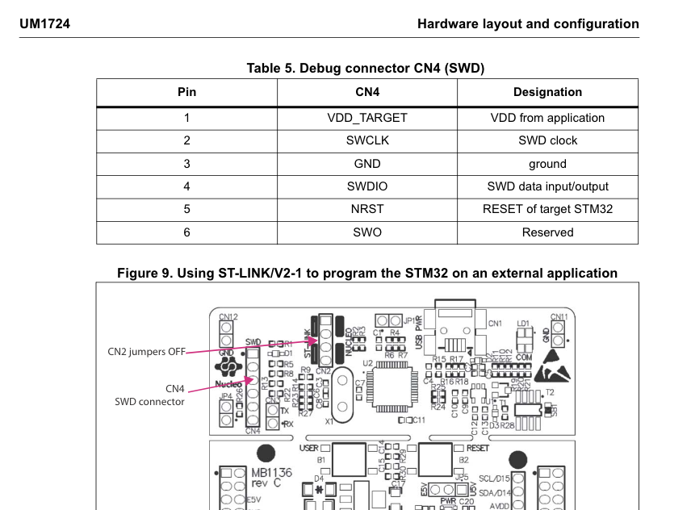
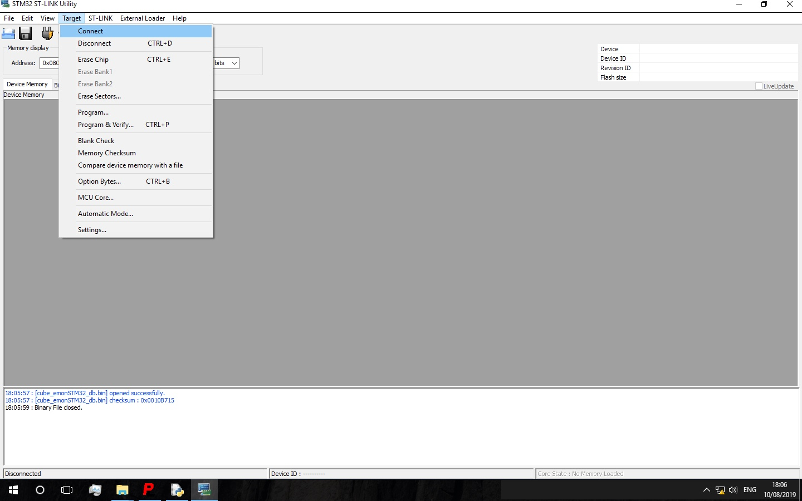
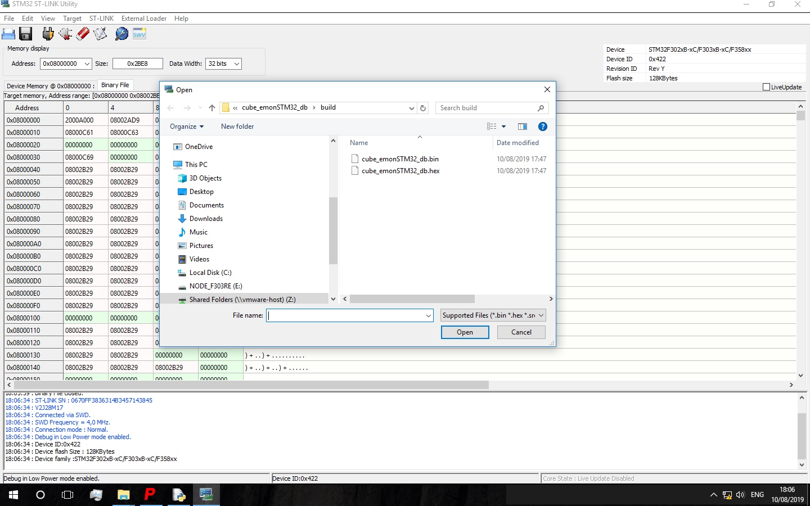
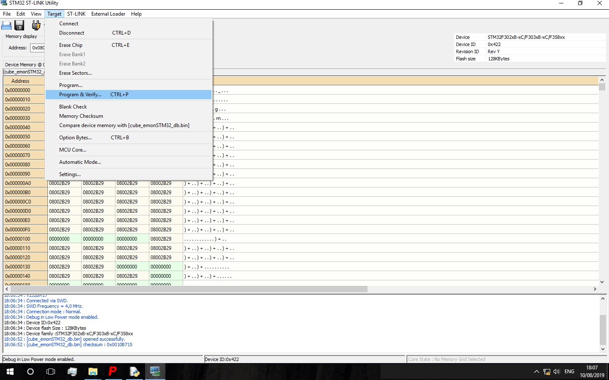
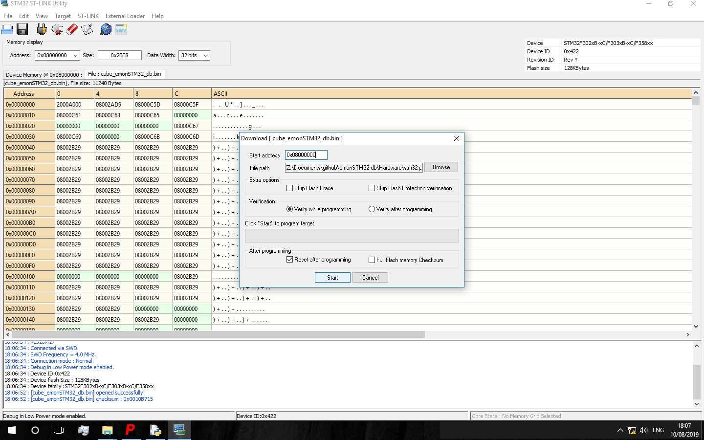

## STM32CubeMX 101: Blink

1. Download and start [STM32CubeMX](https://www.st.com/en/development-tools/stm32cubemx.html).

2. Start a new project. This tutorial uses the STM32F303RE Nucleo development board. Select STM32F303 from the Line category. Select LQFP64 from the Package category. Select STM32F303RE from the MCU List. Finally click on Start Project.

3. The indicator LED is on portA pin5. Click on PA5 in the Pinout MCU viewer, set to GPIO_Output. 

4. Open Project Settings. Name your project e.g Blink, Select Makefile for Toolchain / IDE.
On the Code Generator page, choosen settings suggested by @dBC.

Finaly click Project > Generate Code. This generates the source tree for your project, including most of the HAL calls needed. The code is full of sections such as:

    /* USER CODE BEGIN 2 */
    
    /* USER CODE END 2 */
    
which is where you put your own code.

**Fixing the Makefile**

Open the project directory and then open the Makefile in an editor.

Change 

    BINPATH = 

to: 

    BINPATH = /usr/bin
    
For some reason the section that starts: 

    ######################################
    # source
    ######################################
    # C sources
    C_SOURCES =  \

is full of duplicate entries which causes the compiler to fail, remove the duplicate entries until the compilation is successful.

**Install toolchain for compilation**
    
    sudo apt-get install gcc-arm-none-eabi

**Compile and Upload**

To compile, just type make in terminal:

    make
    
To re-compile:

    make clean
    make

Upload:

    cp build/Blink.bin /media/username/NODE_F303RE/

**Adding in the blink code**

Open Src/main.c in an editor, add the following two lines into the while loop in the user section:

    /* Infinite loop */
    /* USER CODE BEGIN WHILE */
    while (1)
    {
      HAL_GPIO_TogglePin(GPIOA, GPIO_PIN_5);
      HAL_Delay(200);
    /* USER CODE END WHILE */

    /* USER CODE BEGIN 3 */

    }
    /* USER CODE END 3 */

Recompile
    
    make
    
Upload:

    cp build/Blink.bin /media/username/NODE_F303RE/

## Optional: Compile & Upload using PlatformIO

An alternative to using the Makefile is to compile and upload using PlatformIO:

Install platformio http://docs.platformio.org/en/latest/installation.html#local-download-mac-linux-windows

    cd STM32Dev/Blink
    pio run -t upload

## Flashing a fresh chip

To program a new chip, an ST-Link/V2 programmer can be used. This can be a stand alone USB device, or in this case the ST-Link part of a nucleo dev board.

Full doco on this can be found in ST's UM1724.

Here's how I've done it.

The two jumpers on the ST-link(nucleo) at CN2 must be removed.

The CN4 (SWD) header must be connected to the chip's ST-link designated pins. These are JTCK, JTMS, and NRST.

Here's the CN4 pinout:
1.    n/a
2.    T_JTCK: Clock signal of target CPU, connects to PA14 on STM32
3.    GND, connects to GND
4.    T_JTMS: -> SWD data input/output, PA13 on the STM32
5.    T_NRST: Reset -> NRST on the STM32
6.    T_SWO: Single Wire Output -> PB3 (Optional, not needed for firmware upload, used for output)

Only the three pins JTCK, JTMS, and NRST, plus power and GND from somewhere, require connecting. For our dev board I took power from the micro USB connector.

Once connected the next step was to install  on a Windows virtual machine.

See also:
https://community.particle.io/t/how-to-flash-a-brand-new-freshly-soldered-stm32f103-chip/3906/8